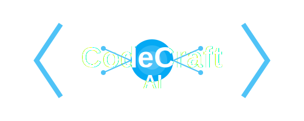

# CodeCraft AI 🚀

<div align="center">



An intelligent code generation platform powered by GPT-4 that creates, executes, and manages code across multiple programming languages.

[](https://opensource.org/licenses/MIT)
[](https://www.python.org/downloads/)
[](https://fastapi.tiangolo.com)
[](https://github.com/psf/black)

</div>

## 🌟 Features

- 🤖 AI-powered code generation using GPT-4
- 🔍 Smart language detection and file management
- ⚡ Real-time Python code execution
- 🎨 Clean, responsive web interface
- 🛠️ Support for 13+ programming languages
- 🔒 Secure code execution environment
- 📁 Automatic file organization

## 🚀 Quick Start

1. Clone the repository:
```bash
git remote add origin https://github.com/Ayanleaideed/CodeCraft-AI.git
CodeCraft-AI
```

2. Set up your environment:
```bash
python -m venv venv
source venv/bin/activate  # On Windows: venv\Scripts\activate
pip install -r requirements.txt
```

3. Configure your environment:
```bash
cp .env.example .env
# Edit .env with your OpenAI API key
```

4. Run the application:
```bash
uvicorn main:app --reload
```

5. Visit `http://localhost:8000` in your browser

## 💻 Supported Languages

| Language   | Extension | Execution |
|------------|-----------|-----------|
| Python     | .py       | ✅        |
| JavaScript | .js       | ❌        |
| TypeScript | .ts       | ❌        |
| Java       | .java     | ❌        |
| C#         | .cs       | ❌        |
| C++        | .cpp      | ❌        |
| Go         | .go       | ❌        |
| Rust       | .rs       | ❌        |
| Ruby       | .rb       | ❌        |
| PHP        | .php      | ❌        |
| Swift      | .swift    | ❌        |
| Kotlin     | .kt       | ❌        |

## 📁 Project Structure

```
codecraft-ai/
├── main.py                # FastAPI application
├── templates/             # HTML templates
│   └── index.html        # Main interface
├── static/               # Static files
│   ├── css/             # Stylesheets
│   ├── js/              # JavaScript files
│   └── logo.png         # Project logo
├── generated_scripts/    # Generated code files
├── requirements.txt      # Python dependencies
├── .env                 # Environment variables
├── .env.example         # Example environment file
├── .gitignore          # Git ignore rules
├── LICENSE             # MIT license
└── README.md           # This file
```

## 🛠️ Development Setup

Ensure you have the following installed:
- Python 3.8+
- pip
- git

Install development dependencies:
```bash
pip install -r requirements-dev.txt
```

## 🧪 Running Tests

```bash
pytest
```

## 📝 Environment Variables

Create a `.env` file with the following:

```env
OPENAI_API_KEY=your_api_key_here
DEBUG=True
```

## 🤝 Contributing

1. Fork the repository
2. Create your feature branch (`git checkout -b feature/amazing-feature`)
3. Commit your changes (`git commit -m 'Add some amazing feature'`)
4. Push to the branch (`git push origin feature/amazing-feature`)
5. Open a Pull Request

## 📜 License

Distributed under the MIT License. See `LICENSE` for more information.

## 👥 Authors

- Ayanle aideed - [@Ayanleaideed](https://github.com/Ayanleaideed)

## 🙏 Acknowledgments

- OpenAI for providing the GPT-4 API
- FastAPI framework
- All contributors who help improve this project

## 📞 Contact

Project Link: [https://github.com/yourusername/codecraft-ai](https://github.com/Ayanleaideed/CodeCraft-AI)
